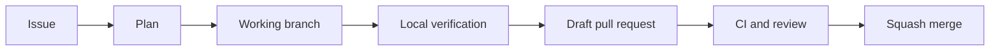

# GitHub and Codex workflow

## Responsibility model

- **GitHub** is the source of truth for code, issues, review, and history.
- **`master`** contains the latest reviewed and stable project state.
- **Issues** describe one outcome and its acceptance criteria.
- **Working branches** isolate every change from the stable branch.
- **Codex** audits, plans, implements, tests, and documents work within the
  agreed scope.
- **The repository owner** approves product choices, portfolio claims, and the
  final merge.
- **GitHub Actions** provides repeatable checks independent of a local machine.

## Change lifecycle

## Pull request boundaries

The modernisation should be delivered as a sequence of focused pull requests:

1. **Workflow foundation** — agent guidance, contribution rules, templates,
   and minimal structural checks.
2. **Repository audit** — inventory dependencies, data sources, notebook
   execution requirements, and reproducibility risks.
3. **Reproducible environment** — define Python support, dependencies, and
   local setup.
4. **Data pipeline** — extract data collection and transformation logic into
   tested modules with documented snapshots.
5. **Analysis and modelling** — reproduce metrics and conclusions with tests
   around critical transformations.
6. **Dashboard** — modernise Dash imports, configuration, data loading, and
   smoke tests.
7. **Portfolio release** — rewrite the README from verified results, add
   screenshots, provenance, and a release tag.

Do not combine all stages into one pull request. Later stages may change as the
audit reveals constraints.

## Issue format

Each issue should state:

- the problem or opportunity;
- the intended outcome;
- relevant files or data;
- constraints and non-goals;
- acceptance criteria;
- verification commands or evidence.

## Review standard

A reviewer should be able to answer four questions from the pull request:

1. What changed?
2. Why was it needed?
3. How was it verified?
4. Which risks or follow-up tasks remain?

Generated charts, metrics, and portfolio claims require a reproducible command
or notebook execution path. Screenshots are supporting evidence, not the source
of truth.
